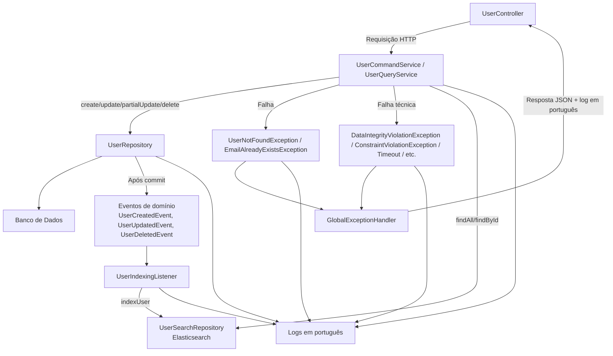

# User Service

Microsserviço **User Service** do sistema **TapTrack**, responsável por gerenciar usuários com arquitetura moderna
baseada em **DDD** + **CQRS**, persistência em **MySQL**, indexação em **Elasticsearch** e suporte  **H2 Database** para
testes.

--- 

## Tecnologias Utilizadas

* Java 25
* Spring Boot 3.5.6
* Spring Web
* Spring Data JPA
* Spring Data Elasticsearch
* Spring Validation
* MapStruct
* Lombok
* MySQL (escrita - prod)
* Elasticsearch (consulta/leitura - prod)
* H2 Database (testes e profile local)
* Docker / Docker Compose
* Testcontainers (para testes de integração)

--- 

## Estrutura do Projeto (DDD + CQRS)

```text
user-service/
├─ src/main/java/com.identityaccessdomain.userservice
│  ├─ api
│  │   ├─ rest/                 # Controllers REST
│  │   ├─ dto/                  # Data Transfer Objects (Request/Response)
│  │   └─ exception/            # Global Exception Handler
│  │
│  ├─ application
│  │   ├─ command/              # Serviços de escrita (POST, PUT, PATCH, DELETE)
│  │   ├─ query/                # Serviços de leitura (GET - Elasticsearch)
│  │   ├─ listener/             # Listeners (ex: indexação no Elasticsearch)
│  │   └─ mapping/              # MapStruct (User <-> DTO <-> Document)
│  │
│  ├─ domain
│  │   └─ user/
│  │       ├─ model/            # Entidade User
│  │       ├─ exception/        # Exceções de negócio
│  │       └─ repository/       # Contratos de repositórios (interfaces)
│  │
│  └─ infra
│      ├─ persistence/          # Implementações JPA (MySQL/H2)
│      └─ search/               # Elasticsearch (UserDocument)
│
├─ src/main/resources/
│  ├─ application.yml
│  ├─ application-local.yml     # H2 Database
│  ├─ application-prod.yml      # MySQL + Elasticsearch
│  ├─ collections/              # Coleções para Postman/Insomnia
│  └─ openapi/                  # Especificações OpenAPI
│
├─ Dockerfile
├─ docker-compose.yml
├─ .env
├─ .env.local
├─ pom.xml
└─ README.md
```

---

## Perfis de Execução

### Local (H2 Database)

* Usado para **desenvolvimento local e testes rápidos**.
* Banco de dados **H2 em memória**.
* Ativo por padrão no `application.yml`.

### Produção (MySQL + Elasticsearch)

* **Escrita** (POST, PUT, PATCH, DELETE): Banco de dados **MySQL**.
* **Leitura** (GET, Listagem, Busca): Banco de dados **Elasticsearch**.

---

## Variáveis de Ambiente

As variáveis de ambiente são configuradas no arquivo `.env` (para produção) e `.env.local` (para desenvolvimento local).

---

## Executando a Aplicação

### Via Docker

1. Certifique-se de que o projeto está compilado: `./mvnw clean package -DskipTests`
2. Crie o `docker-compose.yml` no mesmo diretório do seu `pom.xml` e `Dockerfile`.
3. Executar o Docker Compose: `docker compose up --build -d`
    - `--build`: Garante que a imagem do `user-service` seja reconstruída se houver alterações no `Dockerfile` ou no
      código.
    - `-d`: Executa os contêineres em segundo plano (_detached mode_).
4. Verificar o status: `docker compose ps`
5. Verificar os logs: `docker compose logs -f user-service`
6. Parar e remover:
    - Contêineres e volumes (dados persistentes permanecem por padrão): `docker compose down`
    - Tudo, incluindo volumes (dados serão perdidos): `docker compose down --volumes`

---

## Endpoints REST

### Base Path

`http://localhost:8081/api/v1/users`

### Usuários

* **GET `/users`**: Lista todos os usuários (consulta via Elasticsearch em prod).
* **GET `/users/{id}`**: Busca usuário por ID (consulta via Elasticsearch em prod).
* **POST `/users`**: Cria um novo usuário (escrita via MySQL em prod).
* **PUT `/users/{id}`**: Atualiza um usuário existente (escrita via MySQL em prod).
* **PATCH `/users/{id}`**: Atualiza parcialmente um usuário (escrita via MySQL em prod).
* **DELETE `/users/{id}`**: Deleta um usuário (escrita via MySQL em prod).

---

### Tratamento de Exceções/Erros

Todas as respostas de erro seguem o padrão `ApiErrorResponse`:

```json
{
  "timestamp": "2025-09-28T12:45:30",
  "status": 400,
  "error": "Bad Request",
  "message": "Erro de validação nos campos",
  "path": "/api/v1/users",
  "fields": {
    "email": "O e-mail deve ser válido."
  }
}
```

### Status Suportados

* `200 OK`: Requisição bem-sucedida.
* `201 Created`: Recurso criado com sucesso.
* `204 No Content`: Recurso deletado com sucesso.
* `400 Bad Request`: Erro de validação ou dados inválidos.
* `404 Not Found`: Recurso não encontrado.
* `405 Method Not Allowed`: Método HTTP não permitido.
* `408 Request Timeout`: Tempo de requisição esgotado.
* `409 Conflict`: Conflito de dados (ex: e-mail já existe).
* `500 Internal Server Error`: Erro interno do servidor.

---

## Testes

* JUnit 5
* Mockito
* Testcontainers (para testes de integração com MySQL e Elasticsearch)
* Spring Boot Test

### Executando Testes

```bash
mvn clean test
```

---

## Decisões de Arquitetura

* **DDD (Domain-Driven Design)**: Organização do código em camadas claras (api, application, domain, infra) para manter
  a separação de responsabilidades.
* **CQRS (Command Query Responsibility Segregation)**:
    * Escrita (command) `UserCommandService` (MySQL via JPA).
    * Leitura (queries) `UserQueryService` (Elasticsearch).
* **Indexação**: `UserIndexListener` para manter o Elasticsearch sincronizado com alterações no MySQL.
* **Resiliência**: Tratamento global de exceções com `GlobalExceptionHandler`.

---

## Diagrama de Fluxo

Apresenta o fluxo de operações, tratamento de exceções e eventos de domínio no User Service.

* Controller recebendo requisições HTTP.
* Serviços de comando (command) e consulta (query) separados.
* Exceções de negócio e técnicas tratadas globalmente.
* Publicação de eventos de domínio após operações de escrita.
* Indexação no Elasticsearch via listener.



### Descrição do Fluxo

1. **Controller** recebe a requisição e chama os serviços de comando ou query.
2. **Serviços de comando** manipulam dados no `UserRepository` (Banco de Dados).
3. Após operações de sucesso, eventos de domínio são publicados: `UserCreatedEvent`, `UserUpdatedEvent`,
   `UserDeletedEvent`.
4. `UserIndexingListener` recebe os eventos e atualiza o **Elasticsearch**.
5. **Exceções de negócio** (`UserNotFoundException`, `EmailAlreadyExistsException`) ou técnicas são tratadas pelo *
   *GlobalExceptionHandler**, retornando JSON padronizado e logs em português.
6. Todos os passos imortantes geram **logs em português** para auditoria.

"Quero que gere uma versão “mais visual e colorida”, destacando: Domínios específicos em azul, Infra (DB/Elasticsearch)
em verde e Exceções em vermelho"

---

## Desenvolvedora

**Juliane Maran**

* [LinkedIn](https://www.linkedin.com/in/juliane-maran/)
* [GitHub](https://github.com/JuhMaran)
* [E-mail para Contato](mailto:julianemaran@gmail.com)
* Engenheira de Software Backend (Java/Spring Boot)


